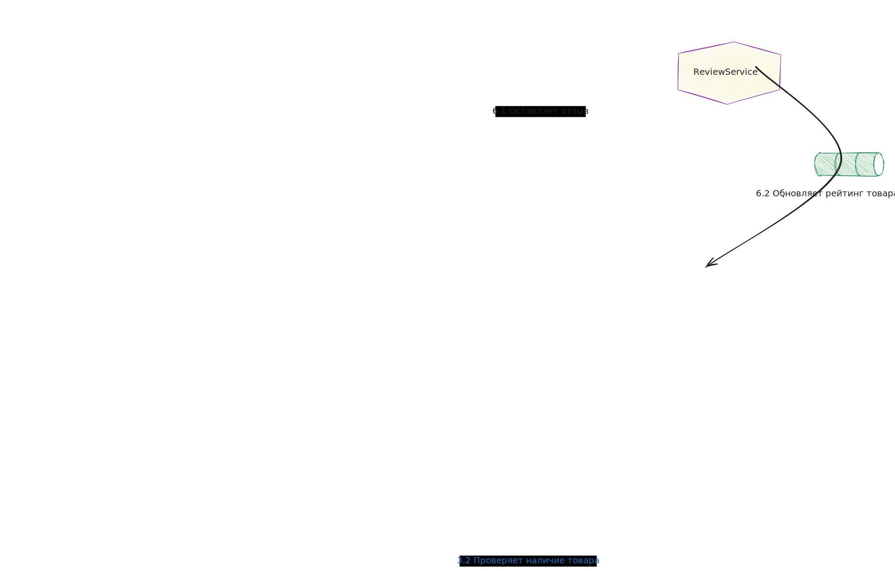
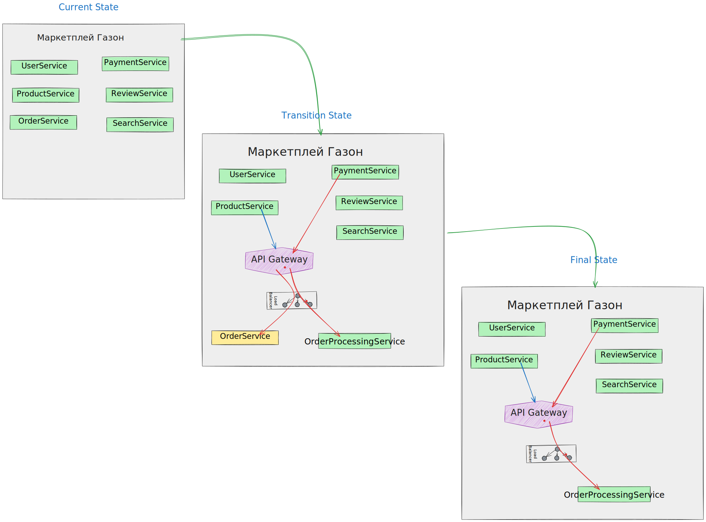

# Выделить часть функционала монолита в микросервис

## Цель:

Подготовить документ-план распила монолита на микросервисы.

## Описание/Пошаговая инструкция выполнения домашнего задания:

1. Выбрать крупную, известную вам информационную систему, в примере по
   [ссылке](https://docs.google.com/spreadsheets/d/1Y-0ExAXsmt-tyQOgjAZv43ReCvMUR5kVcpGN1ppQWGw/edit?usp=sharing)
   представлено Яндекс.Такси. Описать ее назначение и один или несколько ее бизнес процессов
2. Определить необходимые микросервисы, и их назначение (должно быть не менее 5)
3. Описать взаимодействие сервисов в рамках одного из бизнес-сценариев. Т.е. какой микросервис с кем взаимодействует,
   какие данные передает, какие ожидает и способ взаимодействия (синхронно (какая технология?) или асинхронно (какая
   технология?)) Например, при запросе от пользователя нам необходимо: проверить не исключен ли он, затем построить
   маршрут на основе маршрута у тарификатора получить данные о стоимости и
   т.д.
4. Использовать паттерн strangler для одного из микросервисов

---

## Маркетплейс "Газон" - из монолита в микросервисы:

Маркетплейс "Газон" - это платформа, которая соединяет продавцов и покупателей, позволяя продавцам размещать свои
товары и услуги, а покупателям - находить и приобретать их. Основные цели и функции маркетплейса включают:

1. Поддержка множества продавцов: Возможность для различных продавцов размещать свои товары и управлять ими через единую
   платформу.
2. Поиск и фильтрация товаров: Обеспечение удобного поиска и фильтрации товаров для покупателей.
3. Обработка заказов: Интеграция процессов покупки, обработки и выполнения заказов.
4. Платежные услуги: Обеспечение безопасных и удобных методов оплаты для пользователей.
5. Управление отзывами и рейтингами: Позволяет покупателям оставлять отзывы и оценки, которые помогут другим продавцам.
   пользователям в выборе товара.

### Бизнес-процессы маркетплейса "Газон"

1. Регистрация и управление пользователями

    * Процесс регистрации пользователя (покупателя или продавца):
    * Пользователь заполняет форму регистрации.
    * Система отправляет подтверждение на email.
    * Пользователь подтверждает регистрацию, активируя свою учетную запись.

2. Размещение товаров

    * Процесс добавления товара продавцом:
    * Продавец заполняет информацию о товаре (название, описание, цена, фото).
    * Система проверяет информацию на соответствие стандартам.
    * Товар публикуется на платформе и становится доступным для покупателей.

3. Поиск и покупка товара

    * Процесс поиска и фильтрации товара покупателем:
    * Покупатель вводит запрос в поисковую строку.
    * Система обрабатывает запрос и возвращает список релевантных товаров.
    * Покупатель применяет фильтры для уточнения результатов и выбирает товар.
    * Процесс покупки товара:
    * Покупатель добавляет товар в корзину.
    * Покупатель переходит к оформлению заказа.
    * Система обрабатывает заказ и инициирует платежный процесс.
    * После успешной оплаты заказ передается продавцу для выполнения.

4. Обработка заказа и доставка

    * Процесс обработки и выполнения заказа:
    * Система уведомляет продавца о новом заказе.
    * Продавец готовит заказ и передает его в службу доставки.
    * Система обновляет статус заказа и уведомляет покупателя о статусе доставки.

5. Управление отзывами

    * Процесс оставления отзыва покупателем:
    * После получения товара покупатель оставляет отзыв и оценку.
    * Система проверяет отзыв на соответствие правилам.
    * Отзыв публикуется на странице товара и влияет на рейтинг продавца.

### Необходимые микросервисы и их назначение

1. **UserService** (Сервис пользователей): Управление регистрацией, аутентификацией и авторизацией пользователей.
2. **ProductService** (Сервис товаров): Управление информацией о товарах (добавление, изменение, удаление, просмотр).
3. **OrderService** (Сервис заказов): Обработка заказов, управление статусами заказов, уведомления.
4. **PaymentService** (Сервис платежей): Обработка и проверка платежных транзакций.
5. **ReviewService** (Сервис отзывов): Управление отзывами и рейтингами товаров и продавцов.
6. **SearchService** (Сервис поиска): Обработка поисковых запросов и фильтрация товаров.

### Взаимодействие сервисов в рамках одного из бизнес-сценариев

Рассмотрим сценарий поиска и покупки товара покупателем:

1. Пользователь вводит запрос в поисковую строку:

    1. User → SearchService: Вводит запрос.
    2. SearchService → ProductService: Запрос информации о товарах.  
       `Взаимодействие: Асинхронное (использование Kafka для передачи сообщений).`

2. Отображение результатов поиска пользователю:

    * ProductService → SearchService: Возвращает данные о товарах.
    * SearchService → User: Отображает результаты поиска.
    * Взаимодействие: Асинхронное (Kafka).

3. Пользователь выбирает товар и добавляет его в корзину:
    * User → OrderService: Добавляет товар в корзину.
    * OrderService → ProductService: Проверяет наличие товара.
    * ProductService → OrderService: Подтверждает наличие товара.
    * Взаимодействие: Синхронное (REST API).

4. Пользователь оформляет заказ:

    * User → OrderService: Оформляет заказ.
    * OrderService → PaymentService: Обработка платежа.
    * PaymentService → OrderService: Подтверждение платежа.
    * OrderService → User: Подтверждение заказа.
    * Взаимодействие: Синхронное (REST API).

5. Обработка заказа и уведомление:

    * OrderService → User и Seller: Обновляет статус заказа и уведомляет стороны.
    * Взаимодействие: Асинхронное (Kafka).

6. Пользователь оставляет отзыв после получения товара:

    * User → ReviewService: Оставляет отзыв.
    * ReviewService → ProductService: Обновляет рейтинг товара.
    * Взаимодействие: Синхронное (REST API). / Асинхронное (Kafka).

### Паттерн Strangler для микросервисов

Пример применения паттерна Strangler для модернизации Order Service:

1. Current State:

    * Существует монолитный сервис, обрабатывающий заказы.

2. Transition State:

    * Создаем новый микросервис OrderProcessingService, который берет на себя новые функции обработки заказов,
      постепенно перенося их из монолита.
    * Используем API Gateway для маршрутизации запросов. Новые заказы обрабатываются новым микросервисом, старые
      продолжают обслуживаться монолитом.

3. Final State:

    * Полный перенос функционала обработки заказов в новый микросервис, отключение соответствующей части монолита.
    * Микросервис Order Processing Service теперь полностью отвечает за обработку заказов.

---